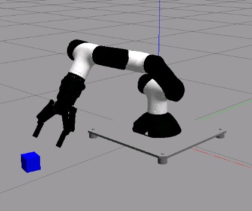

# Robotics1-project :robot: :mechanical_arm:

Robotics1-project aims to realize a position control of the Mara robot in ROS2 with the physics engine Gazebo in order to move a box around.


## Screenshot



## Features

In order to run this project, multiple prerequisites are needed. Please refer to the steps in the [MARA repository](https://github.com/AcutronicRobotics/MARA#install).


## Deployment

:student: To set the Mara robotic joint angles directly:

- step 1: launch the Mara robot in Gazebo
In terminal 1:
```bash
source /opt/ros/foxy/setup.bash
cd ros2_ws
source install/setup.bash
ros2 launch mara_gazebo mara2.launch.py
```
- step 2: set the joint angles (eg. 0°,90°,0°,90°,0°,0°)
In terminal 2:									
```bash
cd ros2_ws
source install/setup.bash
colcon build --packages-select ldmk_package
ros2 run ldmk_package anglespublisher2 0 90 0 90 0 0
```

:woman_student: To deploy a simulation of the Mara robotic arm multiple nodes must be run

- step 1: launch the Mara robot in Gazebo:
In terminal 1:
```bash
source /opt/ros/foxy/setup.bash
cd ros2_ws
source install/setup.bash
ros2 launch mara_gazebo mara2.launch.py
```
- step 2: listen to end-effector position or joint angles commands
In terminal 2:									
```bash
cd ros2_ws
source install/setup.bash
ros2 launch ldmk_package maraik.launch.py
```

- step 3: listen to keyboard commands to move the end-effector
terminal 3:									
```bash
cd ros2_ws
source install/setup.bash
ros2 run ldmk_package teleop_keyboard run
```


## Author

- [@Louise Massager](https://github.com/LouiseMassager/MA1project_ROSMuJoCo/tree/main/new_panda)
- [@Dinh-Hao Nguyen](https://github.com/LouiseMassager/MA1project_ROSMuJoCo/tree/main/new_panda)


## Acknowledgements

- ["Robotics1 project- Mara" of @illias38](https://app.theconstructsim.com/#/Rosjects/mara%20robot).
- ["Test Mara Sim" of @albertoezquerro](https://app.theconstructsim.com/#/Rosjects/mara%20robot).


